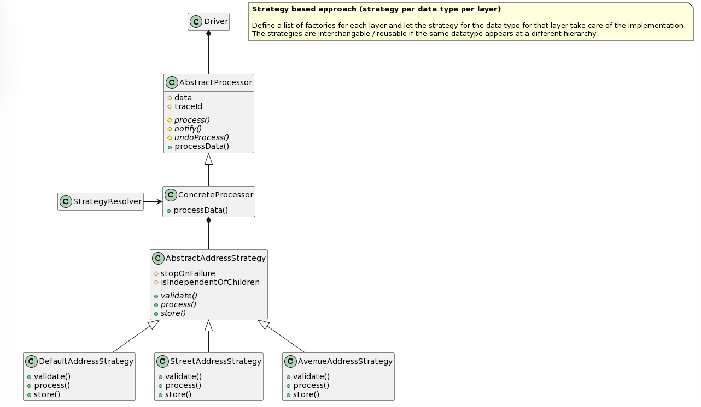
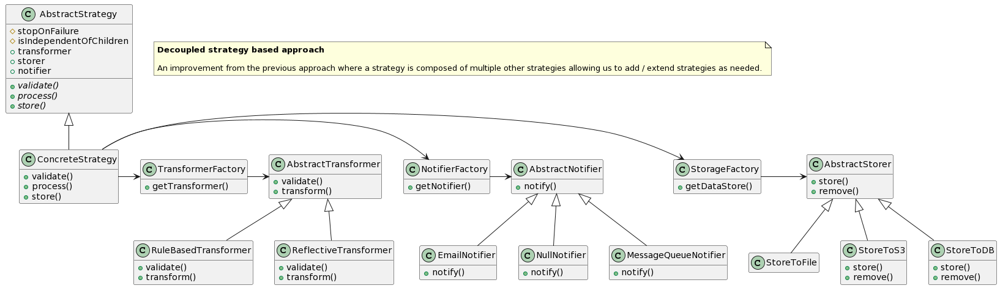

# Problem statement: Processing a stream of multi-layered file data
Let us assume a system that receives a stream of multi-layered files (of average size 15 MB). If you are asked to process the data by conditionally applying the processing rules depending on key attributes that may exist at any level / layer, this repo aims to solution the approach to that problem.

## Assumptions
1. Average size of the file 15 MB
2. Average files per day 2000 files

## Low level design
In both approaches, the first step would involve having the data (at any hierarchy) read and parsed as a JSON object already.

### Approach 1 - One strategy per data type

In this approach, "Strategies" are used to carryout the core tasks - validation.
A strategy is configured for each layer / hierarchy. Depending on `key fields` a default strategy or a field name or field value based strategy could be configured.
#### Code template: 
[One strategy per data type](https://github.com/jay-sridhar/multilayered-dataprocessing/blob/main/src/dataprocessor/one_strategy_per_layer_type.py)
 
#### Advantages:
1. For a new data type, we will be able to plug a strategy without changing the existing code
2. Changing the behaviour of an existing strategy would affect only that data type.

#### Limitations:
1. Class explosion - a very high number of classes / methods need to be maintained
2. Code redundancy - If the processing involves a common themei.e., mapping one data type to another or creating an object from JSON and persist them etc, 

### Approach 2 - Config driven / fine grained strategies per task

In this approach, the various steps that are involved in processing the layered data are listed. They are
1. Validation
2. Transformation 
3. Storing the data
4. Notifying the concerned parties

An abstract class for all the four operations are created.
Depending on the number of various algorithms / strategies we undertake / configure, the concrete classes are created accordingly.
#### Code template: 
[Fine grained strategies by task type](https://github.com/jay-sridhar/multilayered-dataprocessing/blob/main/src/dataprocessor/one_strategy_per_layer_type.py)

#### Advantages
1. Loose coupling - changing a step in the "validation" or "transformation" would involve modifying or extending only one file
2. Config driven - transformations can be kept config driven by creating a mapping in config file / database
3. Extensibility - Ability to add new transformer, storage engine or notifier is easy.

## Add-on features
1. If data at a given layer could be processed independently (without having to process its entire children), we can make use of "Async" framework and let a "Future" object notify the completion
2. Introduction of queues to collate pushes to storage to avoid frequent IO / hard disk writes.
3. Complex transformation steps could be broken down into "intermediate" states. The intermediate data could then be cleared after processing the entire data.
3. Rollback option on failure - `erase()` method in the `Transformer` could be used to find undo processing using `trace_id`
4. Rollback option also allows us to re-process a file again safely

## Choice of tools:
 These choices are driven by assumptions. By looking at the sample data and by understanding the full scope of the transformation we can choose one among the following tools.
1. Kafka for taking the input stream of data
2. CSV or AWS parameter store for configuring the transformation rules. 
3. ELK / Newrelic one for logging. Newrelic one / Datadog for metrics monitoring 
4. ECS for scaling the containers where (step 2) would be running

## Monitoring
1. Memory is a key metric here as we are processing large chunks of data in parallel. Set alerts based on memory thresholds.
2. Log all events with the `trace_id` to effectively track and locate failures.

## Trade-offs

### Reading the file all at once vs buffering

-------
| Category                                                                   | Read all (in memory) | Buffered Reading |
|-----------------------------------------------------------------------------|:-----:| ---- |
| Approach | Read all the contents of the file and have it in memory for processing | Need to buffer till meaningful end of the current hierarchy / layer |
| Ease of implementation | Easy | Complex |
| Ease of Maintenance | Need to be mindful of the file size and monitor it continuously | Need to be mindful of large layers which too can cause a spike in memory footprint |
| Limitations | Need to consider the memory limitations especially during parallel processing of the task. |  Processing time may increase as we are only fetching the data in meaningful chunks|

